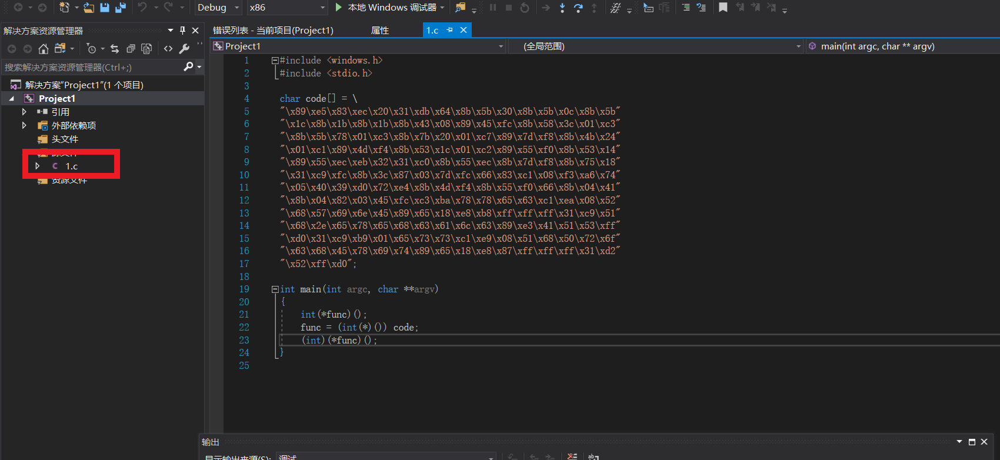
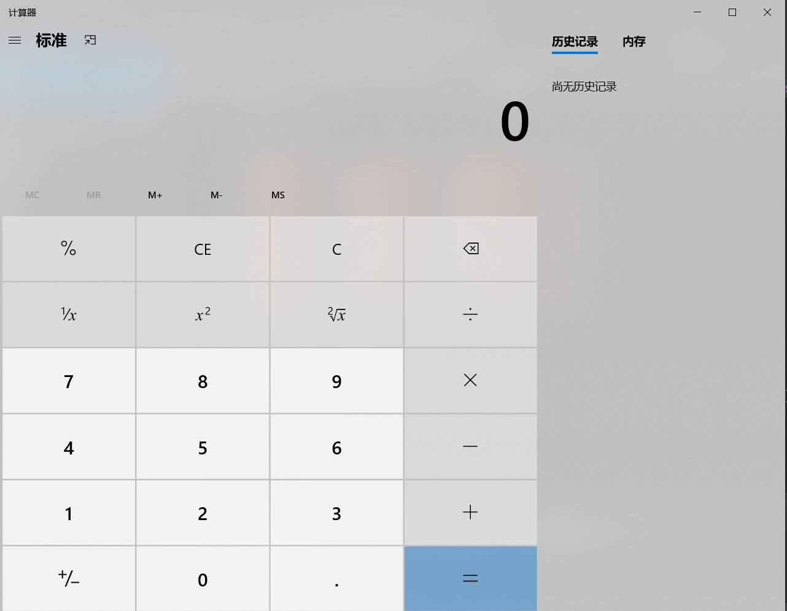
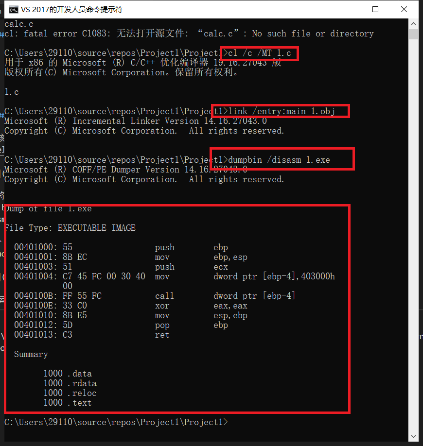
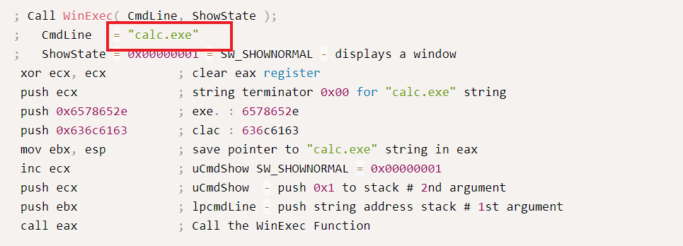
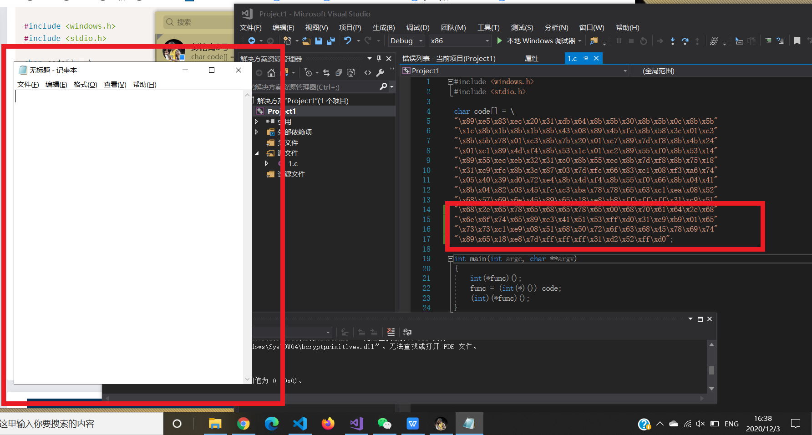

# 实验一：shellcode

## 实验要求：
## （1）把[链接](https://www.exploit-db.com/shellcodes/48116)中shellcode能够成功运行
## （2）从汇编源码编译通过并成功dump
## （3）自行查阅资料，搜索Windows PEB结构体，PE文件导入表导出表相关数据结构的文档，解读shellcode原理
## （4）修改shellcode功能为运行记事本程序notepad. exe
## （5）(选做，难度较大)修改shellcode功能为下载执行器，即下下载一个可执行文件，然后再运行（提示，使用原生API UrlDownloadToFileA）

### 实验过程：
#### 成功运行shellcode
-  代码源文件.cpp修改为.c
-  关闭数据执行保护编译
  

- 运行结果:


#### 从汇编源码编译通过并成功dump



#### shellcode原理
#### 修改shellcode弹出记事本
- 核心是将calc.exe修改为notepad.exe,参照[示例](https://www.exploit-db.com/shellcodes/48116),修改位置如下图所示：


- 将修改后的文件传到VirtualBox中的Kali系统中，执行如下命令,得到十六进制代码
```bash
nasm -f win32 win32-WinExec_Calc-Exit.asm -o win32-WinExec_Calc-Exit.o

for i in $(objdump -D win32-WinExec_Calc-Exit.o | grep "^ " | cut -f2); do echo -n '\x'$i; done; echo
```
- 结果
