## 通过Dll注入实现IAT Hook
 - 分析：1：通过向计算器进程插入用户的DLL文件，钩取IAT的user32.SetWindowTextW() API地址，负责向计算器显示文本的SetWindowTextW() API被钩取之后，计算器中显示出的将是中文数字，而不是原来的阿拉伯数字。2、只需先将要钩取的API在用户的DLL中重定义，然后再注入目标进程即可，缺点是，如果想钩取的API不在目标进程的IAT中，那么就无法使用该技术进行钩取操作，换言之，如果要钩取的API是由程序代码动态加载DLL文件而使用的，那么我们将无法使用这项技术钩取它。
### 实验环境

- virtualbox
- Windows xp

### 目标: 计算器显示中文数字

#### 选定目标API
 - 选定API前先先明确任务目标，我们的目标是把计算器的文本显示框中显示的阿拉伯数字改为中文数字，使用PEView工具查看计算器中导入的API。
  
  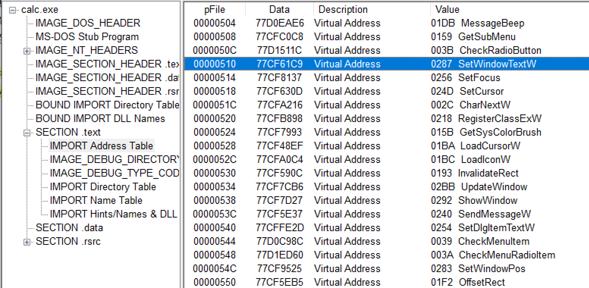


 - 有2个API引人注目，分别是SetWindowTextW()、SetDlgItemTextW()，它们负责向计算器的文本显示框中显示文本，由于SetDlgItemTextW()在其内部有调用了SetWindowTextW()，所以我们先假设只要钩取SetWindowTextW()这1个API就可以了。
  
SetWindowTextW()API定义：
  ```bash
BOOL SetWindowText(
	HWND hWnd,
	LPCTSTR lpString
);
  ```

 - 它拥有两个参数，第一个参数为窗口句柄，第二个参数为字符串指针。


#### 使用Ollydbg验证上面的猜测是否正确。

 - 使用鼠标右键菜单的Search for All intermodular calls命令，查找计算器代码中调用SetWindowTextW() API的部分，然后再所有调用它的地方设置断点，运行计算器，调试器再设置断点的地方暂停。
 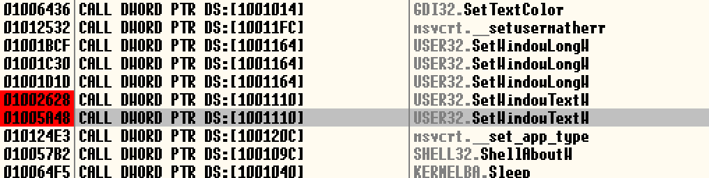

 - 查看栈窗口，可以看到SetWindowTextW() API的lpString参数的值为000DFB0C，进入000DFB0C这个地址，可以看到字符串“0.”被保存为Unicode码形式，该字符串就是显示再计算器显示框中的初始值，继续运行。
 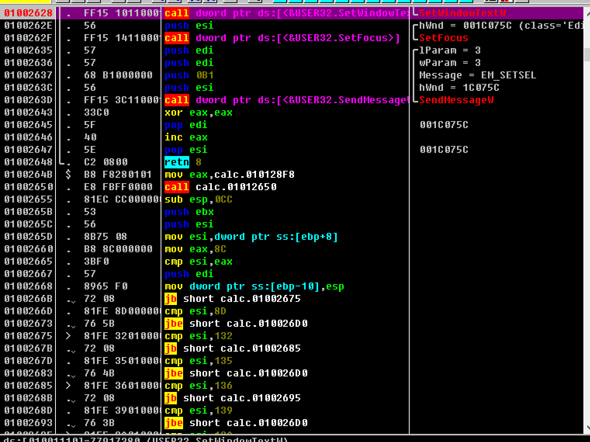

 - 计算器正常运行后，显示框中的字符串为“0."，为了继续调试，再计算器随意输入数字7，由于前面已经设置了断点，所以调试器会在设置的断点处暂停。
 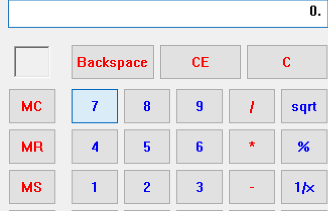
 - 保存Text参数中的字符串地址为000DF688，进入这个地址，可以看到输入的字符串”7."（末尾的“."是由计算器自动添加的字符串）。
 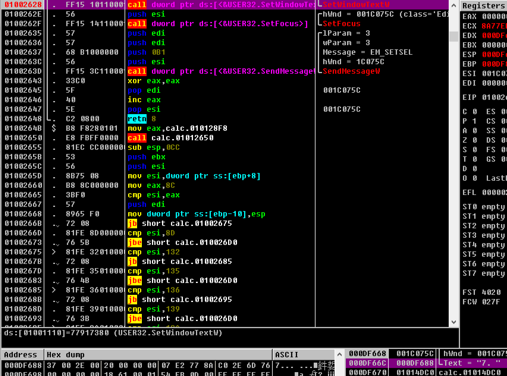

 - 下面尝试把阿拉伯数字7更改为中文数字七，中文数字七对应的Unicode码为4e03，Unicode码中每个汉字占用2个字节。
 - 由于x86系列CPU采用小端序标记法，所以覆写时要逆向进行（034e）进行。
 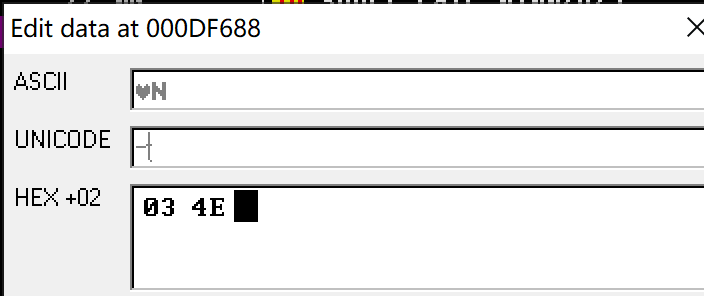

 - 修改了SetWindowTextW()API的lpString参数内容后，继续运行计算器，可以看到原本显示在计算器中的阿拉伯数字7变为中文数字七。
 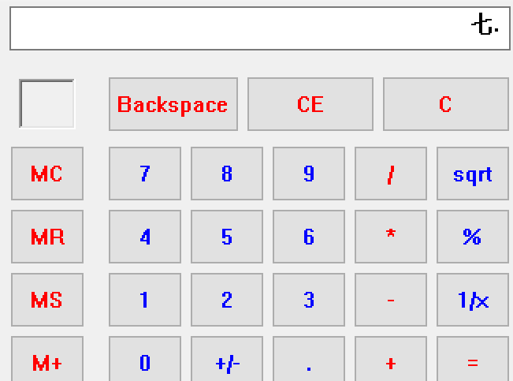

## [IAT钩取](https://www.jianshu.com/p/3636bbd29eb4)
 - 练习示例
 - 运行计算器程序，使用Process Explorere查看计算器进程的PID值。
 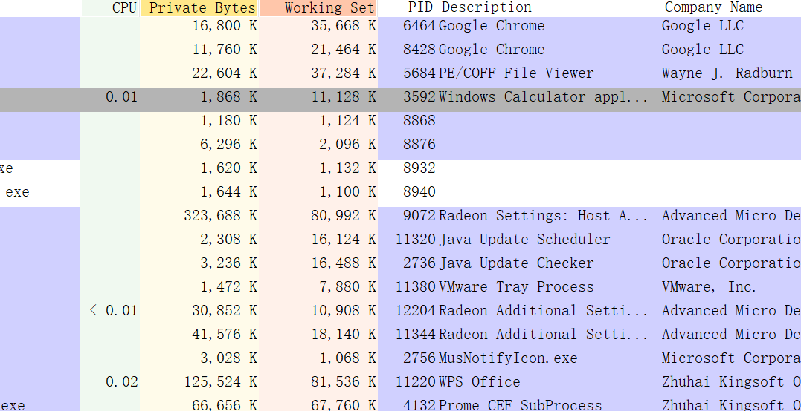
 - 在命令行中输入如下命令
 
 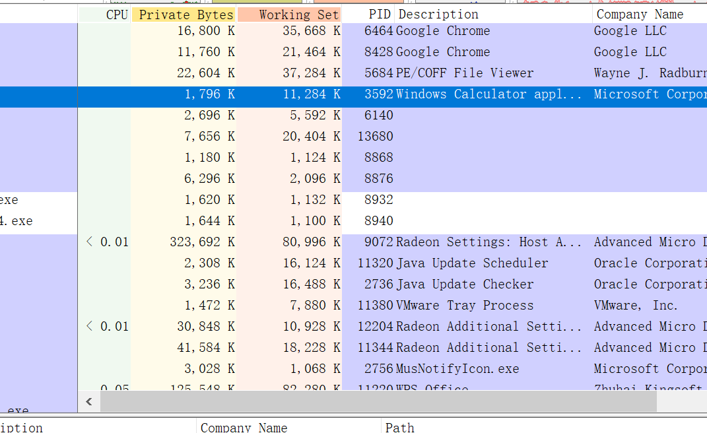
 - 执行脱钩操作，脱钩就是把IAT恢复原值，弹出并卸载已插入的DLL。
 - 弹出后像计算器中输入数字。
 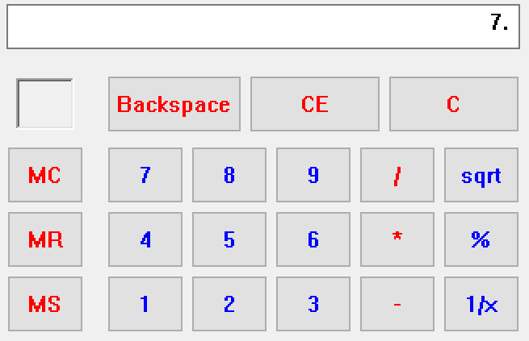

## 源代码分析

 - DllMain()
```bash
BOOL WINAPI DllMain(HINSTANCE hinstDLL, DWORD fdwReason, LPVOID lpvReserved)
{
	switch( fdwReason )
	{
		case DLL_PROCESS_ATTACH : 
            // 保存原始API地址
           	g_pOrgFunc = GetProcAddress(GetModuleHandle(L"user32.dll"), 
                                        "SetWindowTextW");

            // # hook
            // 用hookiat.MySetWindowText()钩取user32.SetWindowTextW()
			hook_iat("user32.dll", g_pOrgFunc, (PROC)MySetWindowTextW);
			break;

		case DLL_PROCESS_DETACH :
            // # unhook
            //  将calc.exe的IAT恢复原值
            hook_iat("user32.dll", (PROC)MySetWindowTextW, g_pOrgFunc);
			break;
	}

	return TRUE;
}

```
 - 在DLL_PROCESS_ATTACH事件中先获取user32.SetWindowTextW()API的地址，然后将其保存到全局变量（g_pOrgFunc),后面脱钩时会用到这个地址。
```bash
g_pOrgFunc = GetProcAddress(GetModuleHandle(L"user32.dll"), "SetWindowTextW");
```
 - 卸载DLL时会触发DLL_PROCESS_DETACH事件，发生该事件时，我们将进行IAT脱钩（将hookiat.MySetWindowTextW()的地址更改为user32.SetWindowTextW()的地址）。
  
 - MySetWindowTextW()
```bash
BOOL WINAPI MySetWindowTextW(HWND hWnd, LPWSTR lpString)
{
    wchar_t* pNum = L"零一二三四五六七八九";
    wchar_t temp[2] = {0,};
    int i = 0, nLen = 0, nIndex = 0;

    nLen = wcslen(lpString);
    for(i = 0; i < nLen; i++)
    {
        // '荐'巩磊甫 '茄臂'巩磊肺 函券
        //   lpString 篮 wide-character (2 byte) 巩磊凯
        if( L'0' <= lpString[i] && lpString[i] <= L'9' )
        {
            temp[0] = lpString[i];
            nIndex = _wtoi(temp);
            lpString[i] = pNum[nIndex];
        }
    }

    // user32!SetWindowTextW() API 龋免
    //   (困俊辑 lpString 滚欺 郴侩阑 函版窍看澜)
    return ((PFSETWINDOWTEXTW)g_pOrgFunc)(hWnd, lpString);
}

```
 - 计算器进程的IAT被钩取后，没当代码中调用user32.SetWindowTextW()函数时，都会首先调用hookiat.MysetWindowTextW()函数。
 - MysetWindowTextW()函数的lpString参数是一款缓冲区，该缓冲区用来存放要输出显示的字符串，所以操作lpString参数即可在计算器中显示用户指定的字符串。
  ```bash

  	nLen = wcslen(lpString);
    for(i = 0; i < nLen; i++)
    {
        // '荐'巩磊甫 '茄臂'巩磊肺 函券
        //   lpString 篮 wide-character (2 byte) 巩磊凯
        if( L'0' <= lpString[i] && lpString[i] <= L'9' )
        {
            temp[0] = lpString[i];
            nIndex = _wtoi(temp);
            lpString[i] = pNum[nIndex];
        }
    }

  ```

  - hook_iat()
  ```bash
  BOOL hook_iat(LPCSTR szDllName, PROC pfnOrg, PROC pfnNew)
{
	HMODULE hMod;
	LPCSTR szLibName;
	PIMAGE_IMPORT_DESCRIPTOR pImportDesc; 
	PIMAGE_THUNK_DATA pThunk;
	DWORD dwOldProtect, dwRVA;
	PBYTE pAddr;

    // hMod, pAddr = ImageBase of calc.exe
    //             = VA to MZ signature (IMAGE_DOS_HEADER)
	hMod = GetModuleHandle(NULL);
	pAddr = (PBYTE)hMod;

    // pAddr = VA to PE signature (IMAGE_NT_HEADERS)
	pAddr += *((DWORD*)&pAddr[0x3C]);

    // dwRVA = RVA to IMAGE_IMPORT_DESCRIPTOR Table
	dwRVA = *((DWORD*)&pAddr[0x80]);

    // pImportDesc = VA to IMAGE_IMPORT_DESCRIPTOR Table
	pImportDesc = (PIMAGE_IMPORT_DESCRIPTOR)((DWORD)hMod+dwRVA);

	for( ; pImportDesc->Name; pImportDesc++ )
	{
        // szLibName = VA to IMAGE_IMPORT_DESCRIPTOR.Name
		szLibName = (LPCSTR)((DWORD)hMod + pImportDesc->Name);
		if( !_stricmp(szLibName, szDllName) )
		{
            // pThunk = IMAGE_IMPORT_DESCRIPTOR.FirstThunk
            //        = VA to IAT(Import Address Table)
			pThunk = (PIMAGE_THUNK_DATA)((DWORD)hMod + 
                                         pImportDesc->FirstThunk);

            // pThunk->u1.Function = VA to API
			for( ; pThunk->u1.Function; pThunk++ )
			{
				if( pThunk->u1.Function == (DWORD)pfnOrg )
				{
                    // 皋葛府 加己阑 E/R/W 肺 函版
					VirtualProtect((LPVOID)&pThunk->u1.Function, 
                                   4, 
                                   PAGE_EXECUTE_READWRITE, 
                                   &dwOldProtect);

                    // IAT 蔼阑 函版
                    pThunk->u1.Function = (DWORD)pfnNew;
					
                    // 皋葛府 加己 汗盔
                    VirtualProtect((LPVOID)&pThunk->u1.Function, 
                                   4, 
                                   dwOldProtect, 
                                   &dwOldProtect);						

					return TRUE;
				}
			}
		}
	}

	return FALSE;
}

  ```
- hook_iat()函数的前半部分用来读取PE文件头信息，并查找IAT的位置。
```bash
	hMod = GetModuleHandle(NULL);
	pAddr = (PBYTE)hMod;
    // pAddr = VA to PE signature (IMAGE_NT_HEADERS)
	pAddr += *((DWORD*)&pAddr[0x3C]);
    // dwRVA = RVA to IMAGE_IMPORT_DESCRIPTOR Table
	dwRVA = *((DWORD*)&pAddr[0x80]);
    // pImportDesc = VA to IMAGE_IMPORT_DESCRIPTOR Table
	pImportDesc = (PIMAGE_IMPORT_DESCRIPTOR)((DWORD)hMod+dwRVA);
```
## 调试被注入的DLL文件
 - 我们要调试的是hookiat.dll文件，它被注入计算器进程，首先运行计算器程序，然后用Process Explorer查看计算器进程的PID值
 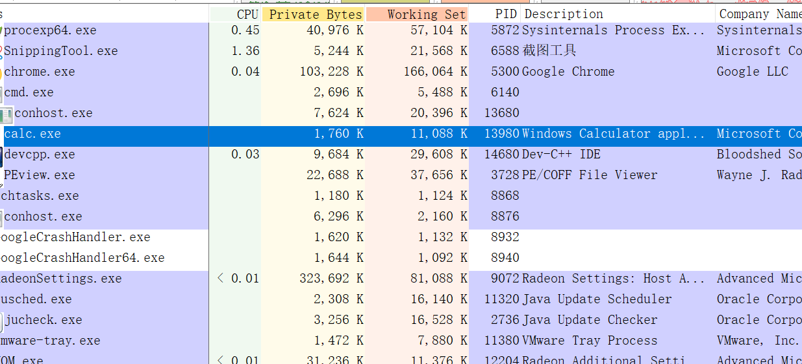
 - 将calc.exe进程附加到Ollydbg
 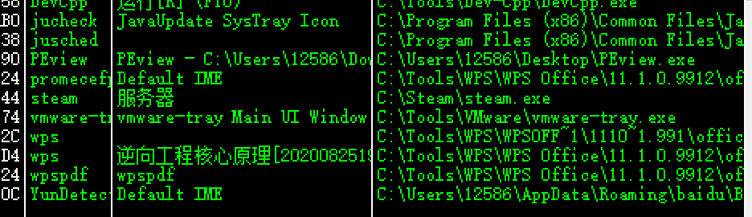
 - 在命令行窗口输入相应参数，运行InjectDll.exe，将hookiat.dll注入到计算器进程。
 - calc.exe进程中发生DLL加载事件时，相关事件就会被通知到OllyDbg，调试器就会在hookiat.dll的EP处暂停下来。
 - 取消复选的Pause on new module（DLL）选项，查找DllMain()代码。
 - 在调试器中查找hookiat.dll的DllMain()函数最简单的方法是，检索DllMain()中使用的字符串或API，DllMain()函数中使用的字符串由”user32.dll"与“SetWindowTextW"，在OllyDbg的代码窗口中选择鼠标右键菜单的Search for All referenced strings选项。
  
### 参考

- [李承远《逆向工程核心原理》](https://blog.csdn.net/bangren3304/article/details/101078611?utm_medium=distribute.pc_relevant.none-task-blog-title-6&spm=1001.2101.3001.4242)
- [Dll注入和卸载](https://www.52pojie.cn/thread-1142368-1-1.html)
- [IAT hook](https://blog.csdn.net/enjoy5512/article/details/51570116)
- [hook技术--IAT hook](https://www.cnblogs.com/freesec/p/6558848.html)
- [简单通过修改IAT HOOK API函数_late0001_新浪博客](http://blog.sina.com.cn/s/blog_af35592a0102vcky.html)
- [dll注入实现IAT勾取-计算器显示中文](https://www.cnblogs.com/hanhandaren/p/11499073.html)
- [计算器显示中文数字](https://blog.csdn.net/qq_39249347/article/details/108239521)